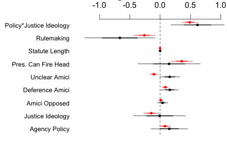

```{r setup, include = FALSE, cache = FALSE, echo = FALSE}
library(knitr)

knitr::opts_chunk$set(echo = FALSE,
                      warning = FALSE, 
                      message = FALSE,
                      cache = FALSE,
                      fig.retina = 2,
                      out.width = "75%",
                      fig.align = "center", 
                      dpi = 100)
# Xaringan: https://slides.yihui.name/xaringan/
library("xaringan")
library("xaringanthemer")
library("here")


xaringanthemer::style_mono_light(base_color = "#3b444b",
          link_color = "#B7E4CF",
          background_color = "#FAF0E6", # linen
          header_font_google = google_font("PT Sans"),
          text_font_google = google_font("Old Standard"),
          base_font_size = "20px",
          text_font_size = "25px",
          padding = "10px",
          code_font_google = google_font("Inconsolata"),
          code_inline_background_color    = "#F5F5F5",
          table_row_even_background_color = "#d5e3dd",
          #extra_css =        list(".remark-slide-number" = list("display" = "none")), # OMIT SLIDE NUMBERS 
          outfile = "docs/xaringan-themer.css")

```


# Data (so far)

## All SCOTUS cases + a random sample of 175 federal circuit court cases 1984-2000 that mention "Administrative Law" in the LexisNexis headnotes.
### - **Ideology:** Justices (Segal-Cover scores) × Policy (Spaeth criteria)
### - Parties, briefs, opinions, outcomes
## Draft & final **rules** + **comments** where rule is at issue


---

### \#1. Does the policymaking process affect judicial review? 

- ❌ -  expertise
- ❌ -  accountability 
- ✅ - participatory/controversial

--

### \#2. Why are policies made through notice and comment more likely to be struck down

- ❌ -  ideological voting 
- ❌ -  selection from lower courts
- ✅ -  controversial/salient (but see #1)

--

### \#3. Is/was *Cheveron/Mead* a jurisprudential regime?

- jurisprudential regimes methods debate using 1984-2000 datasets; **should we revisit? **

---


background-image: url("figs/rulemaking.png")
background-size: contain

---

**Votes Upholding Agency Policy (Logit) **

- <span style="color:red;"> All adlaw cases "Rulemaking" = Rule-like policy</span>  
- Rule-like policymaking cases, "Rulemaking" = notice-and-comment rulemaking

```{r, out.width= "70%"}

```


